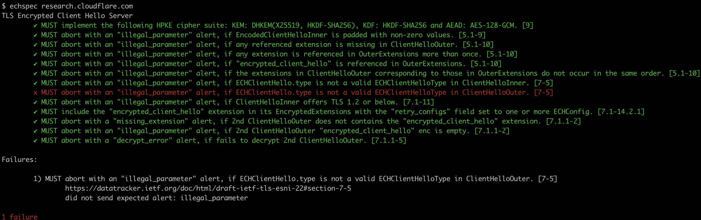

# echspec

[](https://github.com/thekuwayama/echspec/actions/workflows/ci.yml)
[](LICENSE.txt)

`echspec` is a conformance testing tool for ECH implementation.



- https://datatracker.ietf.org/doc/html/draft-ietf-tls-esni-22

## Initial Setup

You can install with:

```sh-session
$ gem install specific_install

$ gem specific_install git@github.com:thekuwayama/echspec.git
```

## Usage

```sh-session
$ echspec --help
Usage: echspec [OPTIONS] <HOSTNAME>
    -f, --file FILE                  path to ECHConfigs PEM file       (default resolve ECHConfigs via DNS)
    -p, --port VALUE                 server port number                (default 443)
    -n, --not-force-compliant-hpke   not force compliant ECHConfig HPKE cipher suite
    -v, --verbose                    verbose mode; prints message stack if raised an error
    -s, --sections SECTIONS          sections to test; by the default, test all sections
```

You can run it the following:

```sh-session
$ echspec research.cloudflare.com
TLS Encrypted Client Hello Server
        ✔ MUST implement the following HPKE cipher suite: KEM: DHKEM(X25519, HKDF-SHA256), KDF: HKDF-SHA256 and AEAD: AES-128-GCM. [9]
        ✔ MUST abort with an "illegal_parameter" alert, if EncodedClientHelloInner is padded with non-zero values. [5.1-9]
        ✔ MUST abort with an "illegal_parameter" alert, if any referenced extension is missing in ClientHelloOuter. [5.1-10]
        ✔ MUST abort with an "illegal_parameter" alert, if any extension is referenced in OuterExtensions more than once. [5.1-10]
        ✔ MUST abort with an "illegal_parameter" alert, if "encrypted_client_hello" is referenced in OuterExtensions. [5.1-10]
        ✔ MUST abort with an "illegal_parameter" alert, if the extensions in ClientHelloOuter corresponding to those in OuterExtensions do not occur in the same order. [5.1-10]
        ✔ MUST abort with an "illegal_parameter" alert, if ECHClientHello.type is not a valid ECHClientHelloType in ClientHelloInner. [7-5]
        ✔ MUST abort with an "illegal_parameter" alert, if ECHClientHello.type is not a valid ECHClientHelloType in ClientHelloOuter. [7-5]
        ✔ MUST abort with an "illegal_parameter" alert, if ClientHelloInner offers TLS 1.2 or below. [7.1-11]
        ✔ MUST include the "encrypted_client_hello" extension in its EncryptedExtensions with the "retry_configs" field set to one or more ECHConfig. [7.1-14.2.1]
        ✔ MUST abort with a "missing_extension" alert, if 2nd ClientHelloOuter does not contains the "encrypted_client_hello" extension. [7.1.1-2]
        ✔ MUST abort with an "illegal_parameter" alert, if 2nd ClientHelloOuter "encrypted_client_hello" enc is empty. [7.1.1-2]
        ✔ MUST abort with a "decrypt_error" alert, if fails to decrypt 2nd ClientHelloOuter. [7.1.1-5]
```

By default, `echspec` retrieves ECHConfigs via HTTPS records. By using the `-f, --file FILE` option, you can specify an ECHConfig pem file. If you need to test the server on localhost, you can run it the following:

```sh-session
$ echspec -f fixtures/echconfigs.pem -p 4433 localhost
```

By default, `echspec` uses the following HPKE cipher suite

- KEM
  - DHKEM(X25519, HKDF-SHA256)
- KDF
  - HKDF-SHA256
- AEAD
  - AES-128-GCM

Using the `-n` or `--not-force-compliant-hpke`, you can not enforce the HPKE cipher suite.

```sh-session
$ echspec -f fixtures/echconfigs.pem -p 4433 -n localhost
```

If you specify the SECTIONS, you can run only SECTIONS the following:

```sh-session
$ echspec -f fixtures/echconfigs.pem -p 4433 -n -s 7.1.1-2,7.1.1-5 localhost
TLS Encrypted Client Hello Server
        ✔ MUST abort with a "missing_extension" alert, if 2nd ClientHelloOuter does not contains the "encrypted_client_hello" extension. [7.1.1-2]
        ✔ MUST abort with an "illegal_parameter" alert, if 2nd ClientHelloOuter "encrypted_client_hello" enc is empty. [7.1.1-2]
        ✔ MUST abort with a "decrypt_error" alert, if fails to decrypt 2nd ClientHelloOuter. [7.1.1-5]
```

Using the `-v` or `--verbose` option provides a message stack if an error occurs. The message stack is formatted as JSON.

```sh-session
$ echspec -s 7-5 -v research.cloudflare.com 2>&1 > /dev/null | jq .
````

<details>

```json
{
  "Alert": {
    "level": "0x02",
    "description": "0x32"
  },
  "ClientHello": {
    "msg_type": "0x01",
    "legacy_version": "0x0303",
    "random": "0x29142f95eb55066cdb496267d3154628685ad1dbbe5b877e66eda4af20df2c69",
    "legacy_session_id": "0x9c557bc381f62d73ba3b99629f8fe6e347787be66c56fa99db4f6bc6fd06fd5f",
    "cipher_suites": [
      "0x1302",
      "0x1303",
      "0x1301"
    ],
    "legacy_compression_methods": [
      "0x00"
    ],
    "extensions": {
      "0x0000": {
        "extension_type": "0x0000",
        "server_name": "0x636c6f7564666c6172652d6563682e636f6d"
      },
      "0x002b": {
        "extension_type": "0x002b",
        "msg_type": "0x01",
        "versions": [
          "0x0304"
        ]
      },
      "0x000d": {
        "extension_type": "0x000d",
        "supported_signature_algorithms": [
          "0x0403",
          "0x0503",
          "0x0603",
          "0x0804",
          "0x0805",
          "0x0806",
          "0x0401",
          "0x0501",
          "0x0601"
        ]
      },
      "0x000a": {
        "extension_type": "0x000a",
        "named_group_list": [
          "0x0017",
          "0x0018",
          "0x0019"
        ]
      },
      "0x0033": {
        "extension_type": "0x0033",
        "msg_type": "0x01",
        "key_share_entry": [
          {
            "group": "0x0017",
            "key_exchange": "0x0421747aa4234dbefc61906c165b8f1050b3346bb67f2c4ad8af9f58135888354a631b9b5c68f8ec1b6d6e67485a971bd3ff0ba6ab46da08f1524d7a4a3578c110"
          },
          {
            "group": "0x0018",
            "key_exchange": "0x046d374a61f2b75717b28b47b3fa227b51e09bb7a4ce0ea24b3cd3c946e9d4da2d54186b76812a74eb53adaa8a4451573201613b2f6301c05efb79bb6a782e88150dc3ac14aad702b8268aa8f3435d1a404166133216467aeb933247f994035fa0"
          },
          {
            "group": "0x0019",
            "key_exchange": "0x0401c90f95f64dc1e8d7d3f29f8a9103308835a2b56f5581ffc2837a1f9fcf6b23db824f01d6e4efccec78d6858aaad2fde8f02c2acc66a463c14b78e5e323b23d1b1301725b4f757811b7a31b4b5ee8016891ecb55b3fb997dd5738f6e610388f9bc85a4515efd04ab1d456e56d4e6e4a3a1e58a58ed6cf86f5dc9d7ace20afcd0af6b23b"
          }
        ]
      },
      "0xfe0d": {
        "extension_type": "0xfe0d",
        "type": "0x02",
        "cipher_suite": {
          "kdf_id": {
            "uint16": 1
          },
          "aead_id": {
            "uint16": 1
          }
        },
        "config_id": 9,
        "enc": "0xe951022abd85cc53f16c92378ba736ea9d28b3a4106a6f2865323ea04fdf4075",
        "payload": "0xbeef20fb3063fd807f6327213a5c5e37a0d355fc67c4c3a10362f947c7b72f06514db0e6bf470efb87d0db30669331caa3723441fb2850190851a9179b8b42e1e7f78bd0d281daf631872d9f7008624e24baef48ac8e18951fed9ad7d80def0b1bec492d5c5c2c532c4c8ec32b6dd3a34522c70c64e21ca639c7f54d2c3ad72c65ffda0dc1f82df5abf0857586eb17f0df08a15770a91d5c3640cff59b49b0fb3d19cf77137cd27416470e19db21519751c3d0ae417a62641903731408b4b81e008fff641d22a3300f92c8b9330d260055677c545a8d561076ecc3a4de5639120f6c67736df87a464ca221373c3bbe8e74dfe795eb43593f1d03d8668d49c4a9a73ed6d3264d7126bcfc93a975c8848170c57322b7c1bef210235bc79fd58bb4ff202d9e75bec3d2251a2429e11e5c7876edcca0685d52e1b99f51b46d0e723975a7c9d894e5674ef8debf380e799d75bff93c13e4917296242e2cb7b99bfcb0fc7cd8f98f414ceb0ef3a63fa29efc722194b91beb354efff5215b1804b9c555d4aad36a85e6eb3536b0b66fea50c9b055fa8441a36fc61a2228e0d4cb3c5ecb1662c641adf30a70c3b1104fb9b0f9b2c3130dc52939e9695a470774bee6dabc2691d06f870d01fe249199d831258583"
      }
    }
  },
  "ClientHelloInner": {
    "msg_type": "0x01",
    "legacy_version": "0x0303",
    "random": "0x99f21aebeff5838b88011e581ade4de4eb334e5528efaf223dfa33c55d7bc20b",
    "legacy_session_id": "0x9c557bc381f62d73ba3b99629f8fe6e347787be66c56fa99db4f6bc6fd06fd5f",
    "cipher_suites": [
      "0x1302",
      "0x1303",
      "0x1301"
    ],
    "legacy_compression_methods": [
      "0x00"
    ],
    "extensions": {
      "0x0000": {
        "extension_type": "0x0000",
        "server_name": "0x72657365617263682e636c6f7564666c6172652e636f6d"
      },
      "0x002b": {
        "extension_type": "0x002b",
        "msg_type": "0x01",
        "versions": [
          "0x0304"
        ]
      },
      "0x000d": {
        "extension_type": "0x000d",
        "supported_signature_algorithms": [
          "0x0403",
          "0x0503",
          "0x0603",
          "0x0804",
          "0x0805",
          "0x0806",
          "0x0401",
          "0x0501",
          "0x0601"
        ]
      },
      "0x000a": {
        "extension_type": "0x000a",
        "named_group_list": [
          "0x0017",
          "0x0018",
          "0x0019"
        ]
      },
      "0x0033": {
        "extension_type": "0x0033",
        "msg_type": "0x01",
        "key_share_entry": [
          {
            "group": "0x0017",
            "key_exchange": "0x0421747aa4234dbefc61906c165b8f1050b3346bb67f2c4ad8af9f58135888354a631b9b5c68f8ec1b6d6e67485a971bd3ff0ba6ab46da08f1524d7a4a3578c110"
          },
          {
            "group": "0x0018",
            "key_exchange": "0x046d374a61f2b75717b28b47b3fa227b51e09bb7a4ce0ea24b3cd3c946e9d4da2d54186b76812a74eb53adaa8a4451573201613b2f6301c05efb79bb6a782e88150dc3ac14aad702b8268aa8f3435d1a404166133216467aeb933247f994035fa0"
          },
          {
            "group": "0x0019",
            "key_exchange": "0x0401c90f95f64dc1e8d7d3f29f8a9103308835a2b56f5581ffc2837a1f9fcf6b23db824f01d6e4efccec78d6858aaad2fde8f02c2acc66a463c14b78e5e323b23d1b1301725b4f757811b7a31b4b5ee8016891ecb55b3fb997dd5738f6e610388f9bc85a4515efd04ab1d456e56d4e6e4a3a1e58a58ed6cf86f5dc9d7ace20afcd0af6b23b"
          }
        ]
      },
      "0xfe0d": {
        "extension_type": "0xfe0d",
        "type": "0x01",
        "cipher_suite": null,
        "config_id": null,
        "enc": null,
        "payload": null
      }
    }
  }
}
```

</details>


## Note

`echspec` is inspired by:

- https://github.com/summerwind/h2spec

## License

`echspec` is available as open source under the terms of the [MIT License](http://opensource.org/licenses/MIT).
